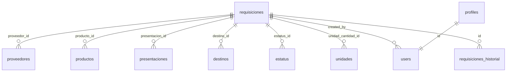

## Introduction

The Cloro de Hidalgo Procurement System uses **PostgreSQL** via **Supabase** to manage purchase requisitions, suppliers, products, and inventory tracking. The database is designed with strong data integrity, role-based security, and audit capabilities.

## Architecture

The database follows a relational model with clear separation of concerns:

- **Catalog Tables**: Reference data for suppliers, products, presentations, destinations, statuses, and units
- **Core Tables**: Main requisition records (`requisiciones`) that reference catalog tables
- **User Management**: Profile extension of Supabase Auth (`profiles`)
- **Audit System**: Change tracking via `requisiciones_historial`

### Technology Stack

<CardGroup cols={2}>
  <Card title="Database" icon="database">
    PostgreSQL 15+ via Supabase
  </Card>
  <Card title="Extensions" icon="puzzle-piece">
    uuid-ossp for UUID generation
  </Card>
  <Card title="Security" icon="shield">
    Row Level Security (RLS) enabled
  </Card>
  <Card title="Auth" icon="lock">
    Supabase Auth with custom profiles
  </Card>
</CardGroup>

## Key Design Decisions

### UUID Primary Keys

All tables use UUID primary keys generated via `uuid_generate_v4()`, providing:
- Globally unique identifiers across distributed systems
- No sequential enumeration security risks
- Easier data merging and replication

### Enum Types

User roles are defined as a PostgreSQL enum:

```sql
CREATE TYPE user_role AS ENUM ('admin', 'coordinadora', 'consulta');
```

This provides type safety at the database level and prevents invalid role values.

### Soft Deletes

Catalog tables include an `activo` (active) boolean field instead of hard deletes, preserving historical data integrity and allowing:
- Restoration of accidentally deactivated records
- Historical reporting on inactive items
- Prevention of foreign key constraint violations

### Audit Trail

The `requisiciones_historial` table tracks all changes to requisitions with:
- Field name modified
- Previous and new values (stored as text)
- User who made the change
- Timestamp of modification

### Automatic Timestamps

All tables include `created_at` timestamp fields. The `requisiciones` and `profiles` tables also have `updated_at` fields that automatically update via trigger:

```sql
CREATE TRIGGER trg_requisiciones_updated_at
  BEFORE UPDATE ON requisiciones
  FOR EACH ROW EXECUTE FUNCTION update_updated_at();
```

## Entity Relationship Overview

The database schema centers around the `requisiciones` table, which references:

1. **proveedores** (suppliers) - Who supplies the product
2. **productos** (products) - What is being ordered
3. **presentaciones** (presentations) - How the product is packaged
4. **destinos** (destinations) - Where the product will be delivered
5. **estatus** (statuses) - Current state of the requisition
6. **unidades** (units) - Measurement unit for quantity
7. **auth.users** - Who created the requisition



## Performance Optimizations

The schema includes strategic indexes for common query patterns:

```sql
CREATE INDEX idx_requisiciones_fecha ON requisiciones(fecha_recepcion);
CREATE INDEX idx_requisiciones_proveedor ON requisiciones(proveedor_id);
CREATE INDEX idx_requisiciones_estatus ON requisiciones(estatus_id);
CREATE INDEX idx_requisiciones_destino ON requisiciones(destino_id);
CREATE INDEX idx_historial_requisicion ON requisiciones_historial(requisicion_id);
```

These indexes optimize:
- Date range queries for reporting
- Filtering by supplier, status, or destination
- Audit history lookups

## Supabase Integration

### Authentication

The system extends Supabase Auth with a custom `profiles` table that:
- Links to `auth.users` via foreign key
- Stores additional user metadata (full name, role)
- Auto-creates on user signup via trigger

### Row Level Security

All tables have RLS enabled, with policies based on the `get_my_role()` helper function:

```sql
CREATE OR REPLACE FUNCTION get_my_role()
RETURNS user_role AS $$
  SELECT rol FROM public.profiles WHERE id = auth.uid();
$$ LANGUAGE sql SECURITY DEFINER STABLE;
```

See [Row Level Security](/database/row-level-security) for detailed policy definitions.

## Seed Data

The schema includes seed data for:
- **6 default statuses** with color codes (Pendiente, Confirmado, En Tránsito, Recibido, Cancelado, En Revisión)
- **8 measurement units** (kg, L, pzs, ton, caj, sac, tam, g)
- **7 destination locations** (warehouses and production lines)
- **8 presentation types** (Granel, Tambor, Cuñete, etc.)
- **5 sample suppliers**
- **8 sample products** (Sosa Cáustica, LABSA, Texapon, etc.)

This provides a working baseline for immediate application use.

## Next Steps

<CardGroup cols={2}>
  <Card title="Tables" icon="table" href="/database/tables">
    Detailed documentation of all tables and columns
  </Card>
  <Card title="Relationships" icon="diagram-project" href="/database/relationships">
    Foreign key relationships and data integrity
  </Card>
  <Card title="RLS Policies" icon="shield-halved" href="/database/row-level-security">
    Security policies and access control
  </Card>
  <Card title="Roles" icon="users" href="/database/roles">
    User roles and permissions matrix
  </Card>
</CardGroup>