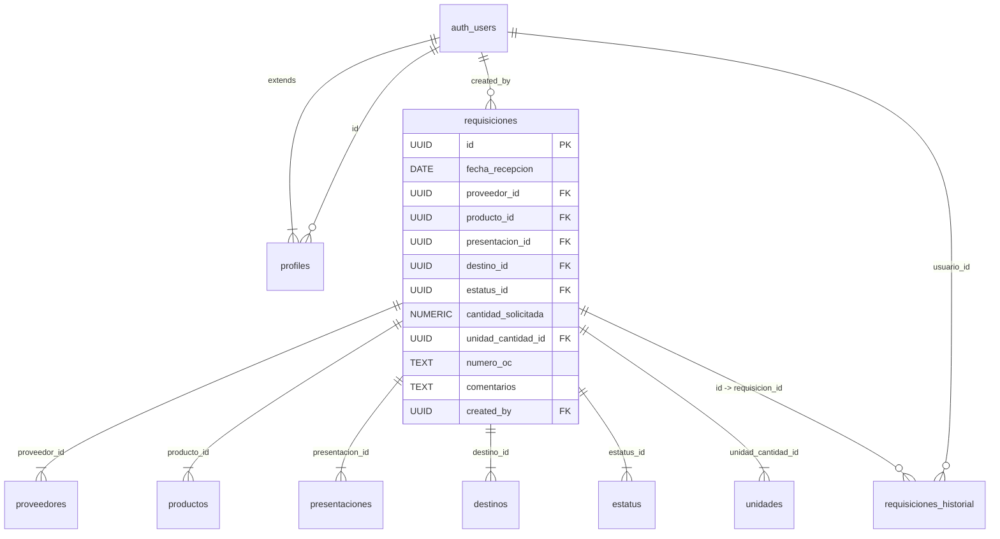

## Overview

The database enforces referential integrity through **foreign key constraints**. The central `requisiciones` table references 7 other tables, creating a star schema pattern ideal for analytical queries and data consistency.

## Relationship Diagram



---

## Primary Relationships

### User Authentication and Profiles

<Accordion title="profiles → auth.users">

**Relationship Type:** One-to-One (1:1)

**Foreign Key:**
```sql
profiles.id REFERENCES auth.users(id) ON DELETE CASCADE
```

**Description:**
The `profiles` table extends Supabase's authentication system. Each user in `auth.users` has exactly one profile record in the `profiles` table.

**Delete Behavior:**
- **CASCADE**: When a user is deleted from `auth.users`, their profile is automatically deleted
- Ensures no orphaned profile records
- Maintains data consistency between auth and application layers

**Usage Example:**
```sql
-- Get user profile with auth data
SELECT 
  u.email,
  p.nombre_completo,
  p.rol
FROM auth.users u
JOIN profiles p ON p.id = u.id
WHERE u.id = auth.uid();
```

</Accordion>

### Requisition Creator

<Accordion title="requisiciones → auth.users (created_by)">

**Relationship Type:** Many-to-One (N:1)

**Foreign Key:**
```sql
requisiciones.created_by REFERENCES auth.users(id)
```

**Description:**
Tracks which user created each requisition. Multiple requisitions can be created by the same user.

**Delete Behavior:**
- **RESTRICT** (default): Prevents deletion of users who have created requisitions
- Preserves audit trail and data integrity

**Usage Example:**
```sql
-- Get all requisitions created by current user
SELECT * 
FROM requisiciones 
WHERE created_by = auth.uid();

-- Count requisitions per user
SELECT 
  p.nombre_completo,
  COUNT(r.id) as total_requisiciones
FROM profiles p
LEFT JOIN requisiciones r ON r.created_by = p.id
GROUP BY p.id, p.nombre_completo;
```

</Accordion>

---

## Catalog Relationships

The `requisiciones` table references 6 catalog tables to normalize data and ensure consistency.

### Supplier Relationship

<Accordion title="requisiciones → proveedores">

**Relationship Type:** Many-to-One (N:1)

**Foreign Key:**
```sql
requisiciones.proveedor_id REFERENCES proveedores(id)
```

**Description:**
Links each requisition to a supplier. Many requisitions can be from the same supplier.

**Index:**
```sql
CREATE INDEX idx_requisiciones_proveedor ON requisiciones(proveedor_id);
```

**Delete Behavior:**
- **RESTRICT** (default): Cannot delete suppliers with existing requisitions
- Instead, use soft delete (set `proveedores.activo = FALSE`)

**Usage Example:**
```sql
-- Get all requisitions from a specific supplier
SELECT 
  r.*,
  prov.nombre as proveedor_nombre
FROM requisiciones r
JOIN proveedores prov ON prov.id = r.proveedor_id
WHERE prov.nombre = 'Proveedora Química Nacional';
```

</Accordion>

### Product Relationship

<Accordion title="requisiciones → productos">

**Relationship Type:** Many-to-One (N:1)

**Foreign Key:**
```sql
requisiciones.producto_id REFERENCES productos(id)
```

**Description:**
Specifies which product is being ordered. A product can appear in multiple requisitions.

**Delete Behavior:**
- **RESTRICT** (default): Cannot delete products with existing requisitions
- Use soft delete (`productos.activo = FALSE`) to retire products

**Usage Example:**
```sql
-- Get total quantity ordered for each product
SELECT 
  p.nombre as producto,
  u.abreviatura as unidad,
  SUM(r.cantidad_solicitada) as total_cantidad
FROM requisiciones r
JOIN productos p ON p.id = r.producto_id
JOIN unidades u ON u.id = r.unidad_cantidad_id
GROUP BY p.id, p.nombre, u.abreviatura
ORDER BY total_cantidad DESC;
```

</Accordion>

### Presentation Relationship

<Accordion title="requisiciones → presentaciones">

**Relationship Type:** Many-to-One (N:1)

**Foreign Key:**
```sql
requisiciones.presentacion_id REFERENCES presentaciones(id)
```

**Description:**
Defines how the product is packaged (drum, bag, bulk, etc.). Same product can have different presentations in different requisitions.

**Delete Behavior:**
- **RESTRICT** (default): Cannot delete presentations in use

**Usage Example:**
```sql
-- See how a product is typically packaged
SELECT 
  prod.nombre as producto,
  pres.nombre as presentacion,
  COUNT(*) as num_requisiciones
FROM requisiciones r
JOIN productos prod ON prod.id = r.producto_id
JOIN presentaciones pres ON pres.id = r.presentacion_id
WHERE prod.nombre = 'Sosa Cáustica'
GROUP BY prod.nombre, pres.nombre;
```

</Accordion>

### Destination Relationship

<Accordion title="requisiciones → destinos">

**Relationship Type:** Many-to-One (N:1)

**Foreign Key:**
```sql
requisiciones.destino_id REFERENCES destinos(id)
```

**Description:**
Indicates where the product should be delivered. Tracks inventory distribution across facilities.

**Index:**
```sql
CREATE INDEX idx_requisiciones_destino ON requisiciones(destino_id);
```

**Delete Behavior:**
- **RESTRICT** (default): Cannot delete destinations with requisitions

**Usage Example:**
```sql
-- Get requisitions by destination
SELECT 
  d.nombre as destino,
  COUNT(r.id) as total_requisiciones,
  SUM(r.cantidad_solicitada) as cantidad_total
FROM requisiciones r
JOIN destinos d ON d.id = r.destino_id
GROUP BY d.id, d.nombre
ORDER BY total_requisiciones DESC;
```

</Accordion>

### Status Relationship

<Accordion title="requisiciones → estatus">

**Relationship Type:** Many-to-One (N:1)

**Foreign Key:**
```sql
requisiciones.estatus_id REFERENCES estatus(id)
```

**Description:**
Tracks the current state of the requisition (pending, confirmed, in transit, received, etc.).

**Index:**
```sql
CREATE INDEX idx_requisiciones_estatus ON requisiciones(estatus_id);
```

**Delete Behavior:**
- **RESTRICT** (default): Cannot delete statuses in use
- Core statuses should never be deleted

**Usage Example:**
```sql
-- Dashboard summary by status
SELECT 
  e.nombre as estatus,
  e.color_hex,
  COUNT(r.id) as total
FROM estatus e
LEFT JOIN requisiciones r ON r.estatus_id = e.id
GROUP BY e.id, e.nombre, e.color_hex
ORDER BY total DESC;
```

</Accordion>

### Unit Relationship

<Accordion title="requisiciones → unidades">

**Relationship Type:** Many-to-One (N:1)

**Foreign Key:**
```sql
requisiciones.unidad_cantidad_id REFERENCES unidades(id)
```

**Description:**
Specifies the measurement unit for the quantity (kg, liters, pieces, etc.).

**Delete Behavior:**
- **RESTRICT** (default): Cannot delete units in use

**Usage Example:**
```sql
-- Get requisitions in specific units
SELECT 
  r.id,
  prod.nombre as producto,
  r.cantidad_solicitada,
  u.abreviatura as unidad
FROM requisiciones r
JOIN productos prod ON prod.id = r.producto_id
JOIN unidades u ON u.id = r.unidad_cantidad_id
WHERE u.abreviatura = 'kg';
```

</Accordion>

---

## Audit Relationships

### History Tracking

<Accordion title="requisiciones_historial → requisiciones">

**Relationship Type:** Many-to-One (N:1)

**Foreign Key:**
```sql
requisiciones_historial.requisicion_id REFERENCES requisiciones(id) ON DELETE CASCADE
```

**Description:**
Tracks all changes made to a requisition. Multiple history records can exist for each requisition.

**Index:**
```sql
CREATE INDEX idx_historial_requisicion ON requisiciones_historial(requisicion_id);
```

**Delete Behavior:**
- **CASCADE**: When a requisition is deleted, all its history records are also deleted
- Maintains referential integrity
- No orphaned audit records

**Usage Example:**
```sql
-- Get change history for a requisition
SELECT 
  h.campo_modificado,
  h.valor_anterior,
  h.valor_nuevo,
  p.nombre_completo as modificado_por,
  h.created_at
FROM requisiciones_historial h
JOIN profiles p ON p.id = h.usuario_id
WHERE h.requisicion_id = 'some-uuid'
ORDER BY h.created_at DESC;
```

</Accordion>

<Accordion title="requisiciones_historial → auth.users">

**Relationship Type:** Many-to-One (N:1)

**Foreign Key:**
```sql
requisiciones_historial.usuario_id REFERENCES auth.users(id)
```

**Description:**
Records which user made each change. Essential for audit compliance.

**Delete Behavior:**
- **RESTRICT** (default): Cannot delete users who have made changes
- Preserves complete audit trail

**Usage Example:**
```sql
-- Audit report: who modified what
SELECT 
  p.nombre_completo,
  COUNT(h.id) as total_cambios,
  MAX(h.created_at) as ultimo_cambio
FROM profiles p
JOIN requisiciones_historial h ON h.usuario_id = p.id
GROUP BY p.id, p.nombre_completo
ORDER BY total_cambios DESC;
```

</Accordion>

---

## Data Integrity Rules

### Referential Integrity

<Card title="Foreign Key Constraints" icon="link">
  All foreign keys enforce referential integrity:
  - Cannot insert a requisition with non-existent supplier, product, etc.
  - Cannot delete catalog items that are referenced by requisitions
  - Cascade deletes clean up dependent records automatically
</Card>

### Soft Deletes

<Card title="Active Status Pattern" icon="trash-can">
  Catalog tables use `activo` boolean for soft deletes:
  - Never hard delete suppliers, products, or other catalogs
  - Set `activo = FALSE` to deactivate
  - Preserves historical data in requisitions
  - Prevents broken foreign key relationships
</Card>

### Check Constraints

<Card title="Data Validation" icon="check">
  Additional integrity rules:
  ```sql
  -- Quantity must be positive
  CHECK (cantidad_solicitada > 0)
  
  -- Color hex must be valid format (implicit)
  -- Enforced at application level
  ```
</Card>

---

## Complex Queries

### Full Requisition Details

```sql
SELECT 
  r.id,
  r.fecha_recepcion,
  r.numero_oc,
  prov.nombre as proveedor,
  prod.nombre as producto,
  prod.descripcion as producto_desc,
  pres.nombre as presentacion,
  r.cantidad_solicitada,
  u.abreviatura as unidad,
  dest.nombre as destino,
  est.nombre as estatus,
  est.color_hex as estatus_color,
  r.comentarios,
  creator.nombre_completo as creado_por,
  r.created_at,
  r.updated_at
FROM requisiciones r
JOIN proveedores prov ON prov.id = r.proveedor_id
JOIN productos prod ON prod.id = r.producto_id
JOIN presentaciones pres ON pres.id = r.presentacion_id
JOIN destinos dest ON dest.id = r.destino_id
JOIN estatus est ON est.id = r.estatus_id
JOIN unidades u ON u.id = r.unidad_cantidad_id
JOIN profiles creator ON creator.id = r.created_by
WHERE r.id = 'some-uuid';
```

### Supplier Performance Report

```sql
SELECT 
  prov.nombre as proveedor,
  COUNT(r.id) as total_ordenes,
  COUNT(CASE WHEN e.nombre = 'Recibido' THEN 1 END) as ordenes_recibidas,
  COUNT(CASE WHEN e.nombre = 'Cancelado' THEN 1 END) as ordenes_canceladas,
  ROUND(
    100.0 * COUNT(CASE WHEN e.nombre = 'Recibido' THEN 1 END) / COUNT(r.id),
    2
  ) as porcentaje_completado
FROM proveedores prov
LEFT JOIN requisiciones r ON r.proveedor_id = prov.id
LEFT JOIN estatus e ON e.id = r.estatus_id
WHERE prov.activo = TRUE
GROUP BY prov.id, prov.nombre
HAVING COUNT(r.id) > 0
ORDER BY total_ordenes DESC;
```

---

## Best Practices

<AccordionGroup>
  <Accordion title="Always Use Transactions for Multi-Table Operations">
    When creating or updating requisitions that affect multiple tables:
    
    ```sql
    BEGIN;
    
    -- Update requisition status
    UPDATE requisiciones 
    SET estatus_id = (SELECT id FROM estatus WHERE nombre = 'Confirmado')
    WHERE id = 'req-uuid';
    
    -- Log the change
    INSERT INTO requisiciones_historial 
      (requisicion_id, campo_modificado, valor_anterior, valor_nuevo, usuario_id)
    VALUES 
      ('req-uuid', 'estatus_id', 'old-id', 'new-id', auth.uid());
    
    COMMIT;
    ```
  </Accordion>
  
  <Accordion title="Use Joins to Avoid N+1 Queries">
    Always fetch related data in a single query:
    
    ```sql
    -- Good: Single query with joins
    SELECT r.*, prov.nombre, prod.nombre, est.nombre
    FROM requisiciones r
    JOIN proveedores prov ON prov.id = r.proveedor_id
    JOIN productos prod ON prod.id = r.producto_id
    JOIN estatus est ON est.id = r.estatus_id;
    
    -- Bad: Separate queries for each requisition
    -- SELECT * FROM requisiciones; (then loop and query each foreign key)
    ```
  </Accordion>
  
  <Accordion title="Leverage Indexes for Performance">
    Use indexed columns in WHERE clauses:
    
    ```sql
    -- Fast: Uses index
    SELECT * FROM requisiciones WHERE proveedor_id = 'uuid';
    SELECT * FROM requisiciones WHERE fecha_recepcion BETWEEN '2026-01-01' AND '2026-12-31';
    
    -- Slower: No index
    SELECT * FROM requisiciones WHERE numero_oc LIKE '%ABC%';
    ```
  </Accordion>
</AccordionGroup>

---

## Next Steps

<CardGroup cols={3}>
  <Card title="Row Level Security" icon="shield-halved" href="/database/row-level-security">
    Learn how RLS policies protect data
  </Card>
  <Card title="User Roles" icon="users" href="/database/roles">
    Understand role-based permissions
  </Card>
  <Card title="Table Reference" icon="table" href="/database/tables">
    View detailed table schemas
  </Card>
</CardGroup>