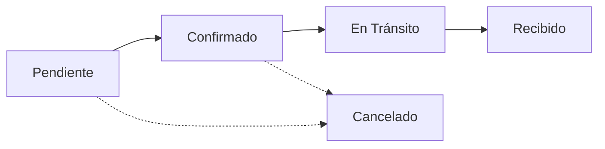

## Overview

The status system tracks requisitions through their complete lifecycle from initial order placement to final delivery confirmation. Each status has an associated color for visual identification across the system.

<Info>
Status values are managed in the **estatus** catalog and can be customized by administrators to match your organization's workflow.
</Info>

## Status Data Structure

```typescript types/index.ts
export interface Estatus {
    id: string              // UUID identifier
    nombre: string          // Status name (e.g., "Pendiente", "Confirmado")
    color_hex: string       // Hex color code for visual coding
    activo: boolean         // Active/inactive flag
    created_at: string      // Creation timestamp
}
```

## Standard Status Workflow

The typical requisition lifecycle follows this progression:



<Steps>
  <Step title="Pendiente (Pending)">
    Initial status when a requisition is created. Awaiting supplier confirmation.
    
    **Color**: Amber/Orange (`#f59e0b`)
    
    **Icon**: Clock
  </Step>
  
  <Step title="Confirmado (Confirmed)">
    Supplier has confirmed the order and provided a delivery date.
    
    **Color**: Green (`#10b981`)
    
    **Icon**: CheckCircle
  </Step>
  
  <Step title="En Tránsito (In Transit)">
    Order has shipped and is on its way to the destination.
    
    **Color**: Blue (`#3b82f6`)
    
    **Icon**: Truck
  </Step>
  
  <Step title="Recibido (Received)">
    Order has been delivered and received at the destination.
    
    **Color**: Gray (`#6b7280`)
    
    **Icon**: PackageCheck
  </Step>
</Steps>

### Alternative States

<AccordionGroup>
  <Accordion title="Cancelado (Cancelled)">
    Order was cancelled before delivery.
    
    **Color**: Red (`#ef4444`)
    
    **Icon**: XCircle
    
    Can transition from Pendiente or Confirmado states.
  </Accordion>

  <Accordion title="En Revisión (Under Review)">
    Order requires additional review or approval.
    
    **Color**: Purple (`#8b5cf6`)
    
    **Icon**: Search
    
    Optional intermediate state between Pendiente and Confirmado.
  </Accordion>
</AccordionGroup>

## Color Coding System

Status colors are consistently applied throughout the application:

### Calendar Events

```typescript components/calendar/CalendarView.tsx
const events: CalendarEvent[] = requisiciones.map(req => {
    const eventColor = req.estatus?.color_hex || '#4266ac'
    return {
        id: req.id,
        title: req.producto?.nombre || 'S/P',
        start: req.fecha_confirmada || req.fecha_recepcion,
        backgroundColor: eventColor,
        borderColor: eventColor,
        extendedProps: {
            requisicion: req,
            estatus_color: eventColor,
        }
    }
})
```

### Table Badges

```typescript app/dashboard/requisiciones/page.tsx
<Badge
    variant="secondary"
    className="text-white border-0"
    style={{ backgroundColor: req.estatus?.color_hex }}
>
    {req.estatus?.nombre}
</Badge>
```

### Event Modals

```typescript components/calendar/EventModal.tsx
<div
    className="px-6 py-5 pb-8 relative"
    style={{ backgroundColor: requisicion.estatus?.color_hex || '#4266ac' }}
>
    <Badge variant="secondary" className="bg-[var(--card)] opacity-95 text-white">
        {requisicion.estatus?.nombre}
    </Badge>
    <DialogTitle className="text-white text-xl font-bold">
        {requisicion.producto?.nombre}
    </DialogTitle>
</div>
```

<Tip>
The system uses the hex color directly from the database, allowing administrators to customize colors without code changes.
</Tip>

## Status Icons

Each status is associated with a visual icon for quick recognition:

```typescript components/calendar/CalendarView.tsx
import {
    XCircle,
    CheckCircle2,
    Search,
    Truck,
    Clock,
    PackageCheck,
    AlertCircle,
    LucideIcon
} from 'lucide-react'

const STATUS_ICONS: Record<string, LucideIcon> = {
    'cancelado': XCircle,
    'confirmado': CheckCircle2,
    'en revisión': Search,
    'en revision': Search,
    'en tránsito': Truck,
    'en transito': Truck,
    'pendiente': Clock,
    'recibido': PackageCheck,
}

const getStatusIcon = (statusName: string = '') => {
    return STATUS_ICONS[statusName.toLowerCase()] || AlertCircle
}
```

<CardGroup cols={3}>
  <Card title="Clock" icon="clock">
    Pendiente - Awaiting action
  </Card>
  <Card title="CheckCircle" icon="check-circle">
    Confirmado - Approved/confirmed
  </Card>
  <Card title="Truck" icon="truck">
    En Tránsito - In delivery
  </Card>
  <Card title="PackageCheck" icon="package-check">
    Recibido - Successfully delivered
  </Card>
  <Card title="XCircle" icon="x-circle">
    Cancelado - Order cancelled
  </Card>
  <Card title="Search" icon="search">
    En Revisión - Under review
  </Card>
</CardGroup>

## Status Changes and Permissions

### Who Can Change Status

Status changes follow role-based permissions:

```typescript lib/actions/requisiciones.ts
export async function updateRequisicion(
    id: string,
    data: Partial<RequisicionFormData>,
    camposModificados: Array<{ campo: string; anterior: string; nuevo: string }>
) {
    const supabase = await createClient()
    const profile = await getCurrentProfile()

    if (!profile || !['admin', 'coordinadora'].includes(profile.rol)) {
        return { error: 'No tienes permisos para editar requisiciones' }
    }
    
    // ... update logic
}
```

<Warning>
Only **admin** and **coordinadora** roles can change requisition status. Other roles have read-only access.
</Warning>

### Automatic Audit Trail

Status changes are automatically logged to the audit history:

```typescript
if (camposModificados.length > 0) {
    await supabase.from('requisiciones_historial').insert(
        camposModificados.map((c) => ({
            requisicion_id: id,
            campo_modificado: c.campo,
            valor_anterior: c.anterior,
            valor_nuevo: c.nuevo,
            usuario_id: user.id,
        }))
    )
}
```

Example audit record for status change:
```json
{
  "requisicion_id": "123e4567-e89b-12d3-a456-426614174000",
  "campo_modificado": "Estatus",
  "valor_anterior": "Pendiente",
  "valor_nuevo": "Confirmado",
  "usuario_id": "user-uuid",
  "created_at": "2024-03-15T10:30:00Z"
}
```

## Status in Database Schema

```sql supabase/schema.sql
CREATE TABLE estatus (
  id          UUID PRIMARY KEY DEFAULT uuid_generate_v4(),
  nombre      TEXT NOT NULL,
  color_hex   TEXT NOT NULL DEFAULT '#6366F1',
  activo      BOOLEAN NOT NULL DEFAULT TRUE,
  created_at  TIMESTAMPTZ NOT NULL DEFAULT NOW()
);

CREATE TABLE requisiciones (
  id                   UUID PRIMARY KEY DEFAULT uuid_generate_v4(),
  estatus_id           UUID NOT NULL REFERENCES estatus(id),
  -- ... other fields
);

CREATE INDEX idx_requisiciones_estatus ON requisiciones(estatus_id);
```

<Note>
The foreign key constraint ensures every requisition has a valid status. The index on `estatus_id` optimizes filtering by status.
</Note>

## Filtering by Status

Users can filter requisitions by status across the application:

### In Requisition Table

```typescript app/dashboard/requisiciones/page.tsx
const [filters, setFilters] = useState<RequisicionFilters>({})

const loadData = async () => {
    setLoading(true)
    const { data, error } = await getRequisiciones(filters)
    if (!error && data) {
        setRequisiciones(data as Requisicion[])
    }
    setLoading(false)
}
```

### In Calendar View

```typescript app/dashboard/calendar/page.tsx
<StatusLegend 
    filters={filters} 
    onFilterChange={setFilters} 
/>
```

Clicking a status in the legend filters the calendar to show only that status.

### Query Implementation

```typescript lib/actions/requisiciones.ts
export async function getRequisiciones(filters?: RequisicionFilters) {
    const supabase = await createClient()

    let query = supabase
        .from('requisiciones')
        .select(`
            *,
            estatus:estatus(id, nombre, color_hex)
        `)
        .order('fecha_recepcion', { ascending: true })

    if (filters?.estatus_id) {
        query = query.eq('estatus_id', filters.estatus_id)
    }

    const { data, error } = await query
    return { data: data ?? [] }
}
```

## Managing Status Catalog

### Creating New Status Values

Administrators can add custom status values:

```typescript lib/actions/catalogos.ts
await createCatalogEntry('estatus', {
    nombre: 'En Aprobación',
    color_hex: '#ec4899',  // Pink
    activo: true
})
```

<Steps>
  <Step title="Navigate to Catalogs">
    Go to Dashboard → Catálogos → Estatus tab
  </Step>
  
  <Step title="Click Nuevo Estatus">
    Opens the creation modal
  </Step>
  
  <Step title="Enter Details">
    - **Nombre**: Status name in Spanish
    - **Color HEX**: Hex color code (e.g., `#10b981`)
  </Step>
  
  <Step title="Save">
    New status is immediately available in requisition forms
  </Step>
</Steps>

### Deactivating Status Values

<Warning>
Deactivating a status does NOT affect existing requisitions using that status. They will continue to display with their assigned status and color.
</Warning>

```typescript lib/actions/catalogos.ts
await toggleCatalogStatus('estatus', statusId, false)
```

Inactive statuses:
- Do not appear in dropdowns for new requisitions
- Still display in requisitions that already use them
- Can be reactivated at any time

## Status-Based Sorting

The table view prioritizes active orders:

```typescript app/dashboard/requisiciones/page.tsx
const sortedData = [...(data as Requisicion[])].sort((a, b) => {
    const isARecibido = a.estatus?.nombre === 'Recibido'
    const isBRecibido = b.estatus?.nombre === 'Recibido'

    // Push "Recibido" (received) items to bottom
    if (isARecibido && !isBRecibido) return 1
    if (!isARecibido && isBRecibido) return -1

    // Secondary sort: by reception date
    return new Date(a.fecha_recepcion).getTime() - new Date(b.fecha_recepcion).getTime()
})
```

<Tip>
This sorting logic keeps active orders (Pendiente, Confirmado, En Tránsito) at the top of the table, while completed (Recibido) orders sink to the bottom.
</Tip>

## Best Practices

<AccordionGroup>
  <Accordion title="Use Consistent Color Scheme">
    Follow standard conventions:
    - **Waiting/Pending states**: Warm colors (amber, orange)
    - **Success/Confirmed states**: Green
    - **In-progress states**: Blue
    - **Completed states**: Gray or muted colors
    - **Error/Cancelled states**: Red
  </Accordion>

  <Accordion title="Keep Status Names Clear">
    Use descriptive, unambiguous names. Avoid abbreviations or codes that require explanation.
  </Accordion>

  <Accordion title="Limit Number of Statuses">
    Too many status options can confuse users. Aim for 4-7 distinct statuses that cover all necessary states.
  </Accordion>

  <Accordion title="Document Workflow">
    Clearly communicate to your team which status transitions are valid (e.g., can you go directly from Pendiente to Recibido, or must you pass through Confirmado?).
  </Accordion>
</AccordionGroup>

## Accessibility Considerations

<Note>
Don't rely solely on color to convey status. The system includes:
- Text labels on all status badges
- Icons for each status type
- High contrast color selections
</Note>

## Related Features

<CardGroup cols={2}>
  <Card title="Audit History" icon="clock-rotate-left" href="/features/audit-history">
    View complete history of status changes
  </Card>
  <Card title="Catalog Management" icon="book" href="/features/catalogs">
    Manage status values and colors
  </Card>
  <Card title="Calendar View" icon="calendar" href="/features/calendar">
    Visual status indicators on calendar events
  </Card>
  <Card title="Requisition Management" icon="file-text" href="/features/requisitions">
    Change requisition status during editing
  </Card>
</CardGroup>